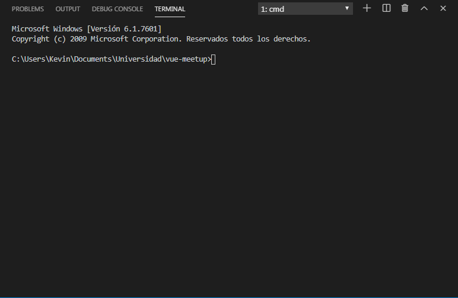

# Dynamo
# Juan Sebastián Ensuncho - Kevin Liberato
- https://ingesoft2666310998.wordpress.com
# Link proyecto red
http://192.168.0.4:8080
# Link despliegue
http://35.238.232.228:8080/

# Como correr el proyecto en local
Se hace la respectiva instalación de la carpeta donde esta alojada el proyecto vue-meetup con el comando $ npm install
se procede a inicializar el servidor y desplegar la aplicacion localmente con $ npm run serve 
y en otra terminal en la carpeta vue-meetup/server usamos $ node index.js de la siguiente manera:

# Documento Devops y Cloud Pattern Utilizado
https://docs.google.com/document/d/1Fyc9mylEMw41H5KKnXEoruAS-njT07Fx7F25MNoZSyU/edit?usp=sharing
